# 播放器 UI 参考图片归档

本页索引用户在项目早期提供的两组共 20 张图片。图片均按原字节复制到 `reference-images/`，未压缩、未裁切、未重新编码。原临时文件名只保留 basename，不记录用户临时目录绝对路径。

## 使用要求（来自用户对话）

- 参考图中的优秀播放器构图、封面材质、歌词布局、卡片、按钮与频谱形态应能通过公开主题参数复刻。
- 所有弹层的色彩、字体对比、圆角、阴影和材质必须与主主题统一。
- 白色、黑色、樱粉等主题切换后，歌曲信息、下拉框、媒体卡、设置和队列都必须可读。
- 第二组最后一张图用于参考多种音频律动/频谱形态。
- 参考图是设计输入，不代表允许按主题名写隐藏 CSS 或硬编码坐标。

## 第一组（10 张）

| # | 预览 | 原附件 basename | 尺寸 | 字节 | SHA-256 |
|---:|---|---|---:|---:|---|
| 1 | 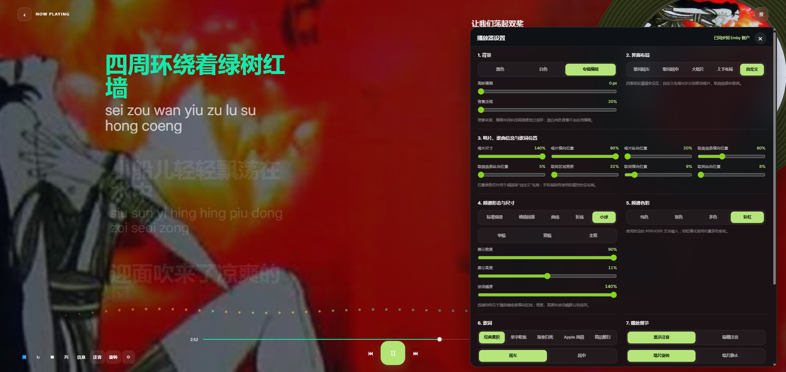 | `codex-clipboard-b448bd8b-945c-48c7-98f4-3227715cad9b.png` | 1920×911 | 1,400,994 | `52E19CC40CC34160C5287A2695E880C6F1B99EB90547BD53007232FD9D43EE9F` |
| 2 | 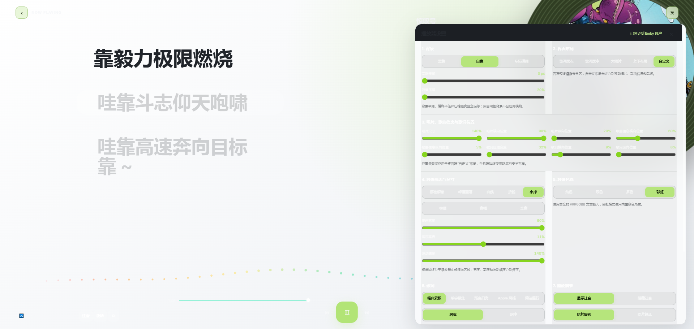 | `codex-clipboard-77a5e9f6-c152-4fc0-b3ea-cb4517883f54.png` | 1920×911 | 872,047 | `4394547840DBC586B0CC9DA920F7BC285A49A3317172C09A56C2B8255274DDA3` |
| 3 | 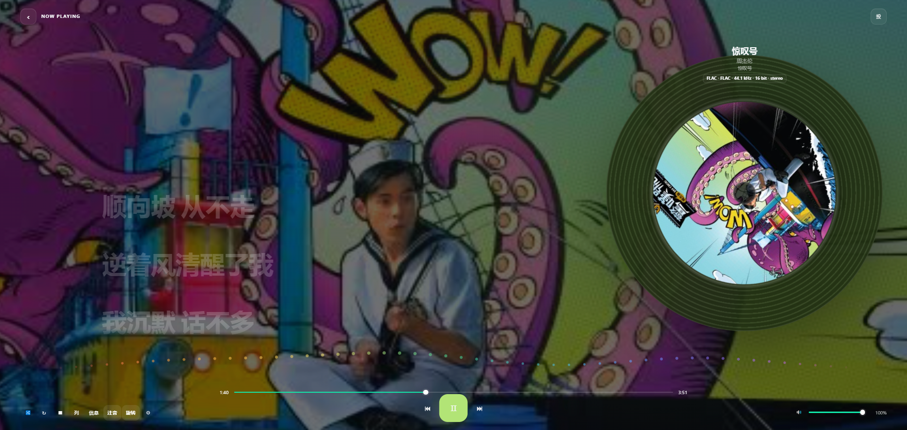 | `codex-clipboard-13ecd4ba-4200-4043-aff8-19f01c826005.png` | 1920×911 | 2,515,874 | `A2FF558F52514687A94576D0386DCBF6A55129CE97E2C7965D5328723B0F52C6` |
| 4 | 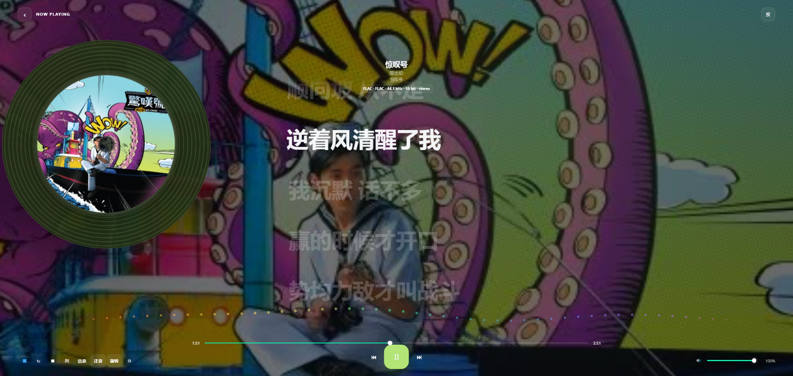 | `codex-clipboard-6cc6edfa-fb64-44e1-ad9b-dd08e8d8eb39.png` | 1920×911 | 2,509,437 | `331D6212F044CB5A0D9D50B3D2298FA84A4B53F6589BFD54E155DA002CF64DCF` |
| 5 | 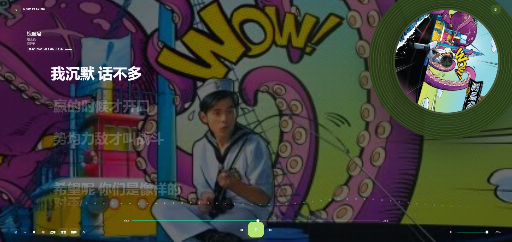 | `codex-clipboard-745cb640-3fae-408a-a1b5-72c19df63210.png` | 1920×911 | 2,548,118 | `DACF90E74A06E7150C54241BD2F30C9362E4347048B53A3168C5239F57C5E120` |
| 6 | 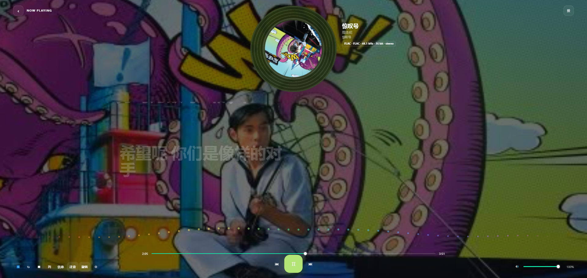 | `codex-clipboard-a4e13c49-6f77-42b7-bc13-5689c9841ff2.png` | 1920×911 | 2,406,961 | `BD812F16931DBB850111CF036B03E8D595E2D13E8A44EBF3C3474D8A54AB068F` |
| 7 |  | `codex-clipboard-7a46d526-ac88-4849-b6e6-258cde997904.png` | 1920×911 | 2,531,144 | `28A8B018AF1F3F22F594526D1C37A2A0AB84A5845154250F7B44415B962427BF` |
| 8 | 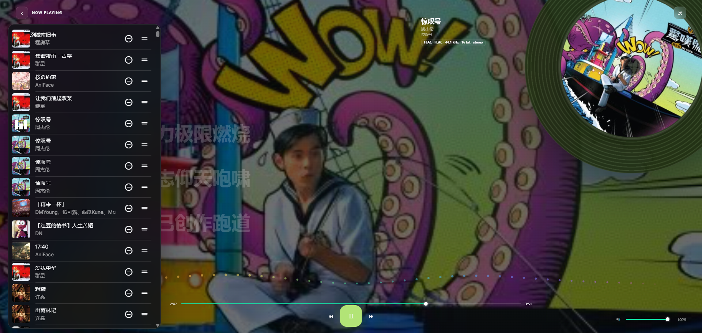 | `codex-clipboard-53551c5b-8b07-463a-90ba-fbc9a4b66271.png` | 1920×911 | 2,294,368 | `4D94B1A7AFCC9F48B24E749C886F16B65F11BD089566B565486BDCD2EA00302A` |
| 9 | 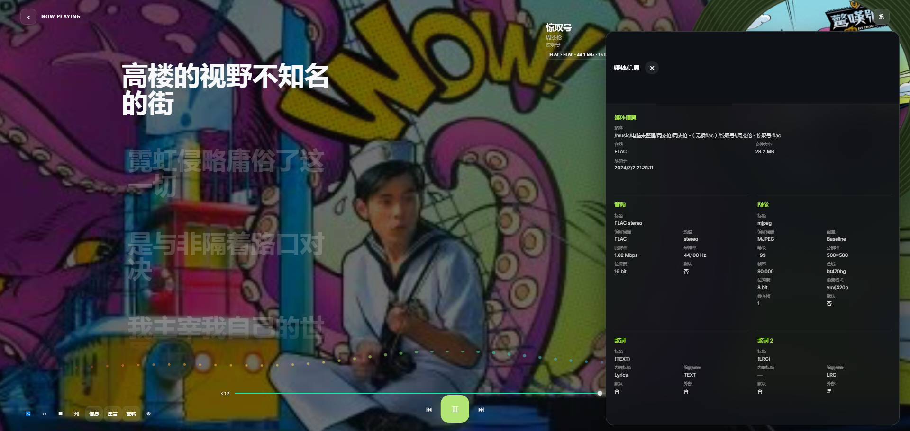 | `codex-clipboard-a6c7df93-f5eb-46ab-9325-f59bde4febfd.png` | 1920×911 | 1,883,462 | `356AC5B0BF48EC04322AD46B0ECF2E061E850DEFCD5632CD8AEF277484FD2C48` |
| 10 |  | `codex-clipboard-34eb68a9-2864-42a7-a61c-7f8b9caeb47e.png` | 355×80 | 40,651 | `44C01DE4AF73AEA2078FE9876072F5B7B45E496779EEB3132E689D39607E525A` |

## 第二组（10 张）

| # | 预览 | 原附件 basename | 尺寸 | 字节 | SHA-256 |
|---:|---|---|---:|---:|---|
| 1 | 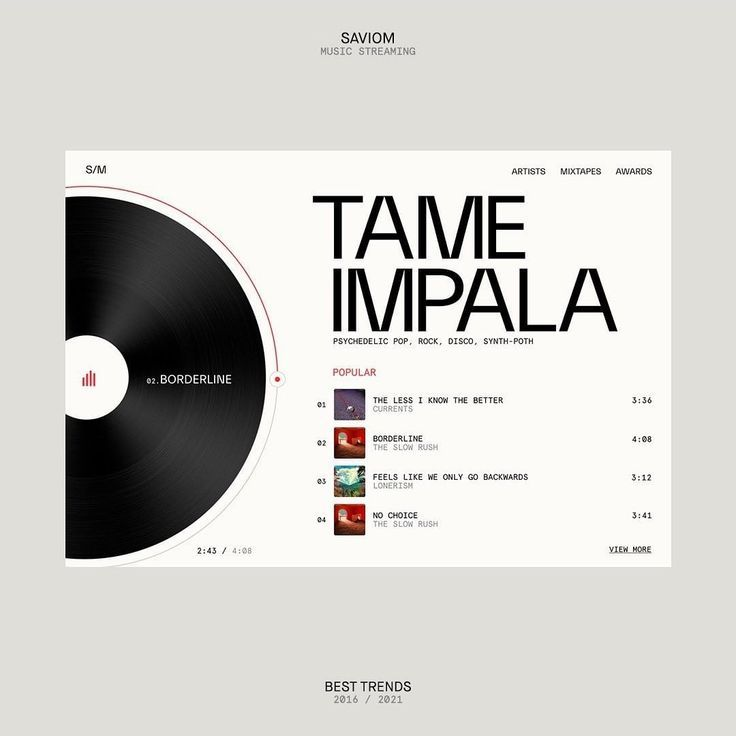 | `codex-clipboard-f0b9568f-f168-4f2e-b4ce-fdf8f7dfc089.png` | 736×736 | 199,945 | `B4225F685A0C3221A3D19056FAC7724F839DF741F947573B894B3FBBC2DB6117` |
| 2 | 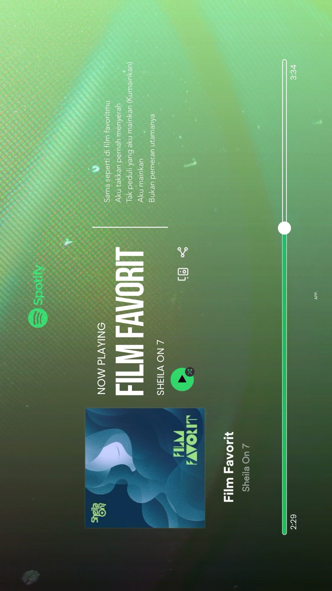 | `codex-clipboard-82adfd84-8413-403c-ba76-3299acedfd93.png` | 1200×2133 | 1,937,423 | `C68EAC2278D484BCD599D9F848E267292A9630395EECAF0A68CAF27A7ABFE997` |
| 3 | 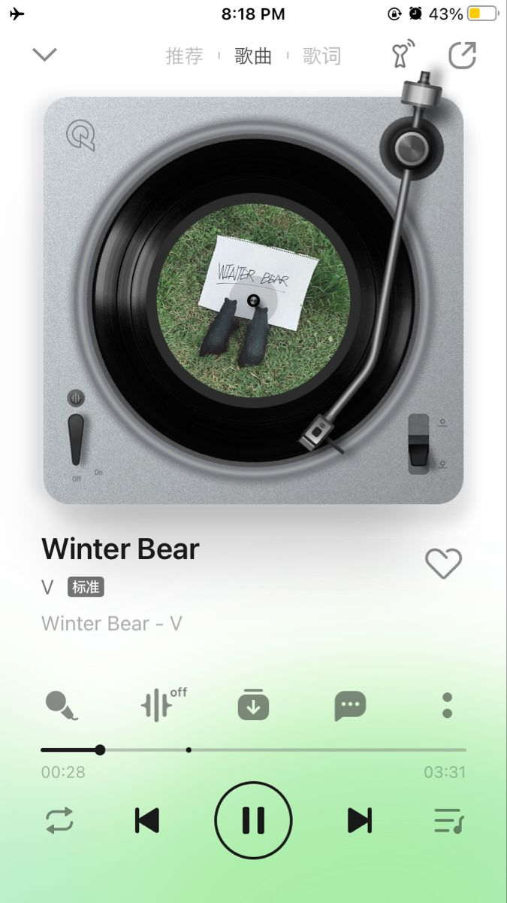 | `codex-clipboard-c35818c8-acf6-4af0-a9c7-c3f009247894.png` | 675×1200 | 550,612 | `EC357FAF758112D16A48FBFF15B146F0435ABEFCFB8DBF7121D513B648DFF767` |
| 4 | 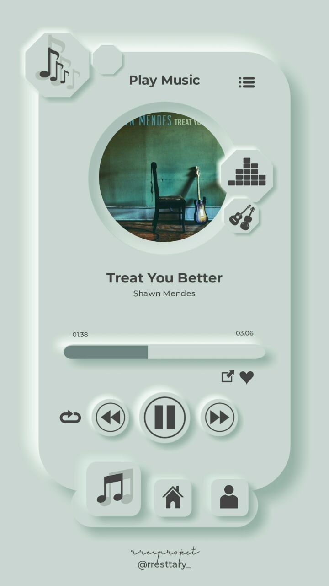 | `codex-clipboard-72f00a78-a83d-4199-8d20-f308a99acd7c.png` | 720×1280 | 351,627 | `A3A28DF4AA950F57C54BA0FF3EDE45B2D29780E4527EC242CD753D13681D5EE1` |
| 5 | 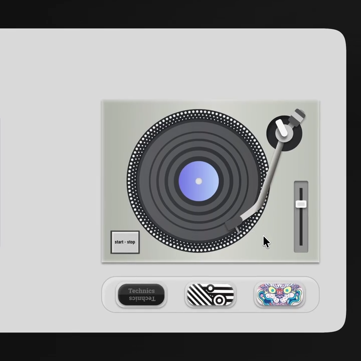 | `codex-clipboard-bbc0e7d8-58c8-47d3-a3b5-8da35f8cfc5d.png` | 720×720 | 193,004 | `649B65AEAE661C7C942FB59D8BB2765F0D74B47D95C5509F192145ACBE886279` |
| 6 | 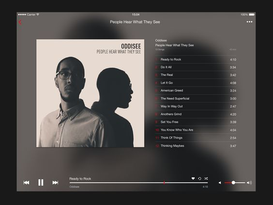 | `codex-clipboard-ba1308b0-7539-4abb-8300-7a64fed19af7.png` | 564×423 | 128,091 | `E87B21C3FA866A1B11F6C303272760CCE740E2C8B52E6B426186BF19EFF8A2C3` |
| 7 |  | `codex-clipboard-fdbc0bf8-3d85-4f9a-9335-e76ad7fd62b8.png` | 736×552 | 386,213 | `8CBF173878A32DEAAAD78EC1059D5A4F4D960B182A119CBDB9DFC1E6901AE1E4` |
| 8 | 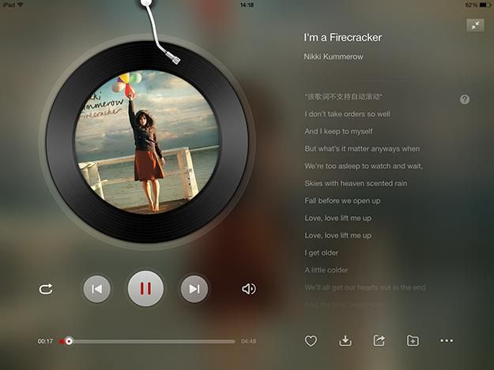 | `codex-clipboard-71e55894-3962-4a1e-8172-c7c17e808db5.png` | 625×469 | 242,838 | `C55ED1B80F8F69C53EAACCB9E818A8C5DD683DD1FB68779B8FC3464A64FF706E` |
| 9 | 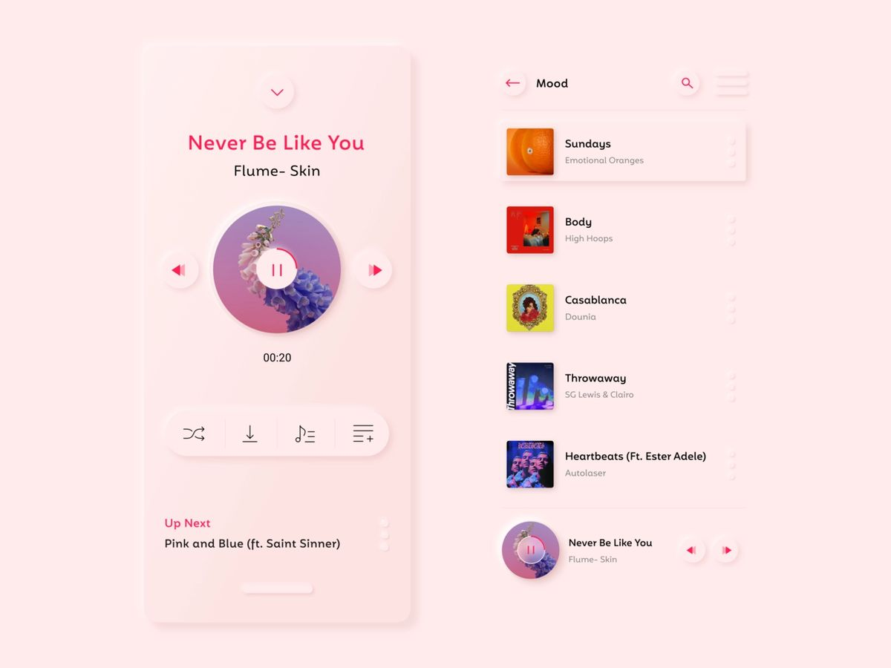 | `codex-clipboard-24502490-77c6-43a3-998b-b131589c663c.png` | 1200×900 | 305,502 | `26556515B05920AE92BE31577557A22387D6862C13F4B4D80D57B3E97B7549C9` |
| 10 | 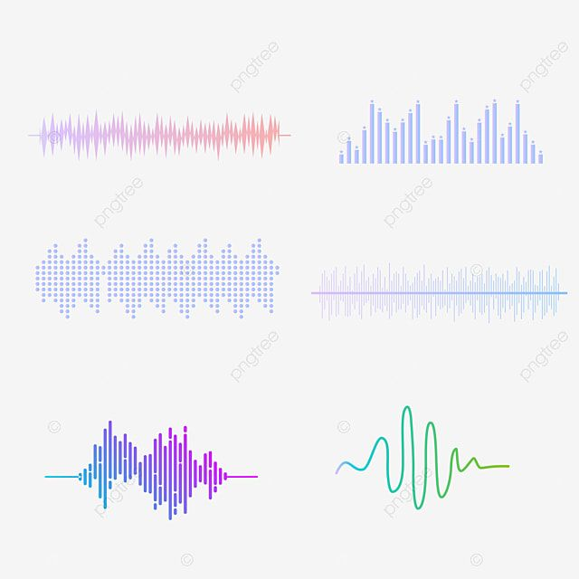 | `codex-clipboard-3255a09e-0ae9-4a92-acf5-28f0449e1226.png` | 640×640 | 210,075 | `C588968BBD49B35FA415B15A6EBFE5A343D05A302DF307B5F4105F318AE87B44` |

## EDE 参考附件

| 文件 | 字节 | SHA-256 | 说明 |
|---|---:|---|---|
| [ede-v1.47.user.js](attachments/ede-v1.47.user.js) | 266,934 | `B6E8DF2ED50C3B2B924A8181950D3A058F40EC4C34B93EDEAF088EEC0CE843C4` | 用户提供的 Emby Danmaku Extension 1.47 参考脚本；头部声明 MIT 许可证和原项目来源。 |

附件保留原始编码和内容。静态扫描未发现写死的真实 token/Cookie；脚本自身包含运行时读取 Emby access token 并拼接请求的逻辑，因此不应把浏览器运行时导出的 URL、日志或认证值补写进本归档。
